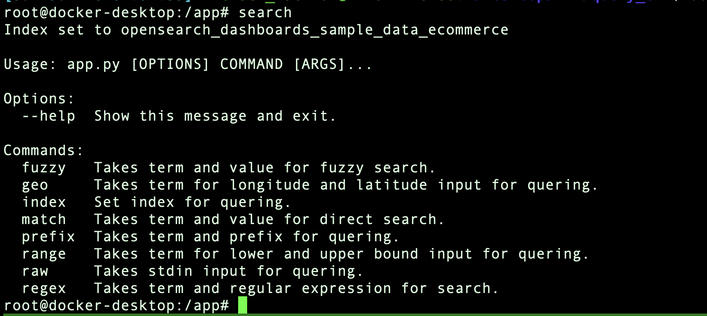
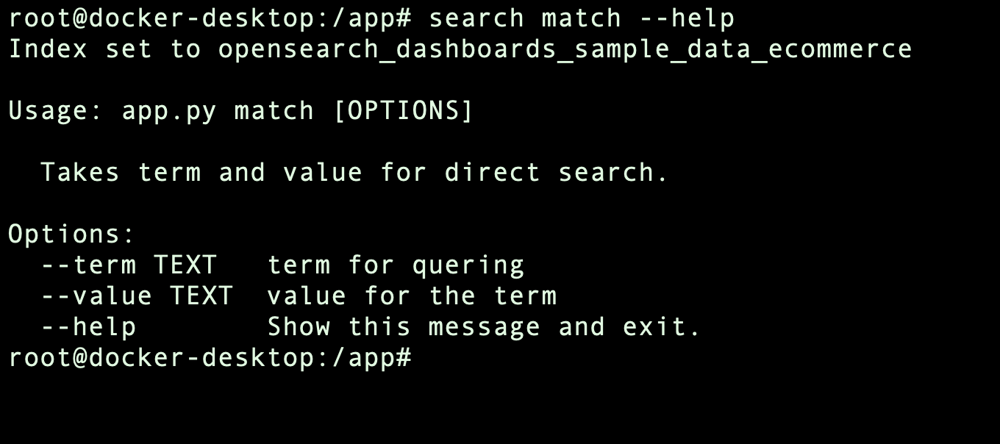
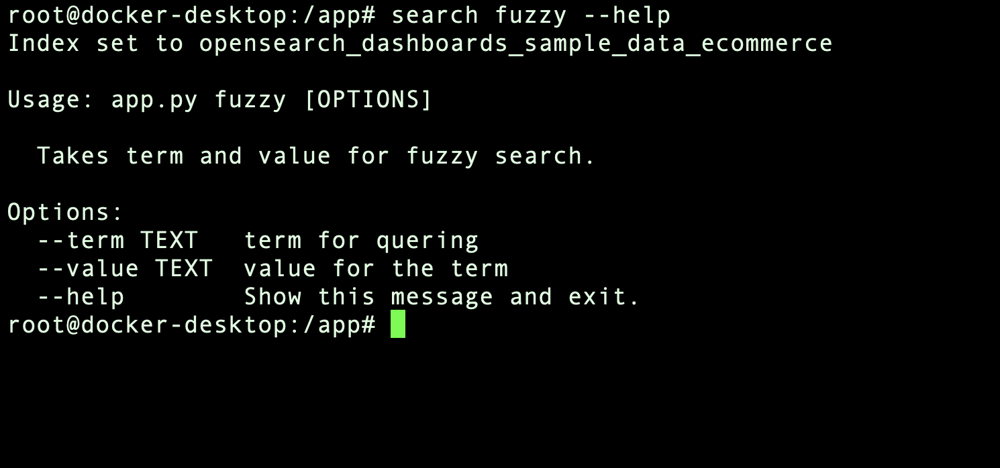
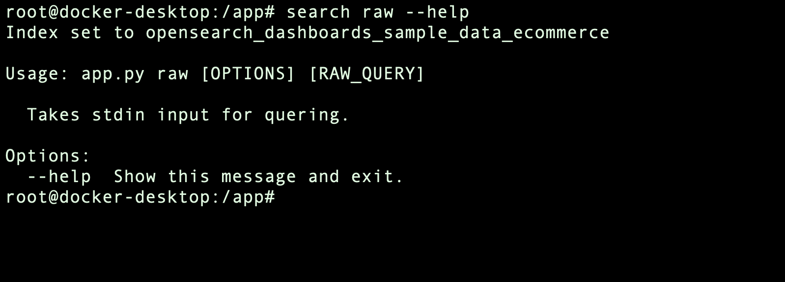
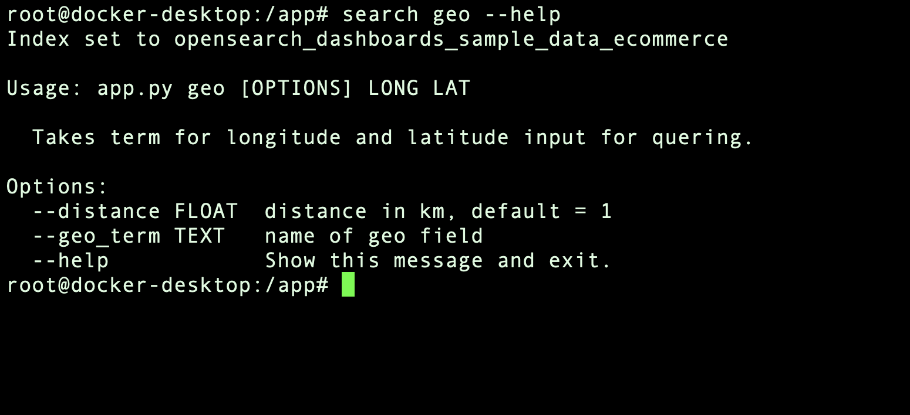
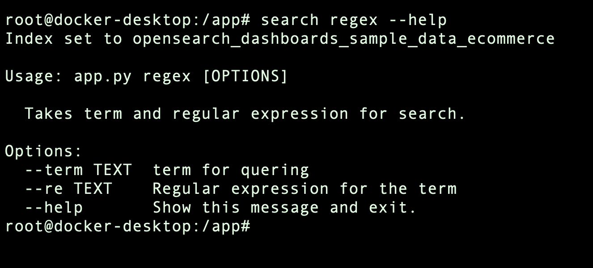
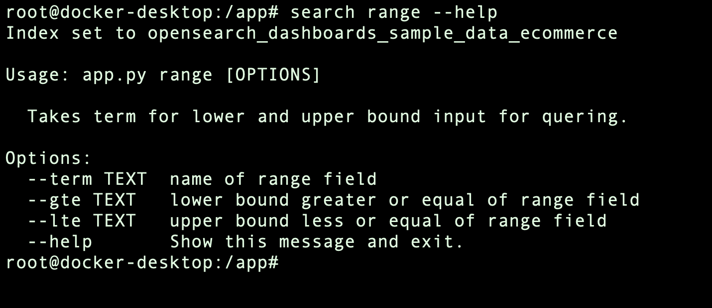
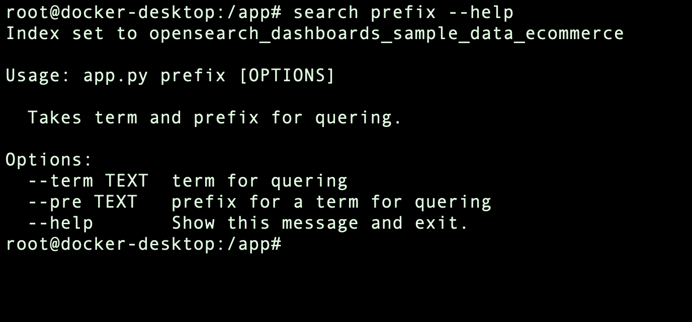

# Task description

Develop simple console or web app (up to you) application, that would connect to Elasticsearch and would provide ability to use at least 7 different types of queries that you either learned in this section or in the Elasticsearch documentation

Ideally reuse practice task from module 6 and select appropriate dataset which would provide you ability to try several types of queries, not just text, but also range and distance

# The implementation

1. match [Docs](https://www.elastic.co/guide/en/elasticsearch/reference/current/query-dsl-term-query.html)
2. fuzzy [Docs](https://www.elastic.co/guide/en/elasticsearch/reference/current/query-dsl-fuzzy-query.html)
3. raw
4. geo [Docs](https://www.elastic.co/guide/en/elasticsearch/reference/current/query-dsl-geo-distance-query.html)
5. regexp [Docs](https://www.elastic.co/guide/en/elasticsearch/reference/current/query-dsl-regexp-query.html)
6. time/number range [Docs](https://www.elastic.co/guide/en/elasticsearch/reference/current/query-dsl-range-query.html)
7. prefix [Docs](https://www.elastic.co/guide/en/elasticsearch/reference/current/query-dsl-prefix-query.html)


# Run it with suitable env

``` bash
# local setup
docker-compose -f ./docker/docker-compose.yml up -d
```

# Add data

## Go to [localhost:5061](localhost:5061)


## Add `opensearch_dashboards_sample_data_ecommerce` or whatever index you like
## NB
Default terms for queries are from `opensearch_dashboards_sample_data_ecommerce` and it's a default index to search.


# Build docker image

``` bash
sudo docker build -t cli_es -f docker/Dockerfile .
```

# Run image

``` bash
docker run --network=host -it cli_es
```

# Usage within container

## For simplicity `search` alias is used to run the app in container


## Will give you an overview for possible commands and basic desription



``` bash
search
```

To change index type 
``` bash
search index "index_name"
```
You should see message if index exists
``` bash
Index set to "index_name"
```

Otherwise
``` python
ValueError: Index 'index_name' doesn't exist.
```

## Run every command `search command --help` to find out more

## 1. Match 



## Example

``` bash 
search match --term="geoip.city_name" --value="Cairo"
```

## 2. Fuzzy 



## Example

``` bash
# There is no Gwan but Gwen
search fuzzy --term="customer_first_name.keyword" --value="Gwan"
```

## 3. Raw 



## Example

``` bash
# Read query from file
search raw < example_query.json
```

## 4. Geo 



## Example

``` bash
# To deal with negative numbers add "--" as in example
search geo --geo_term="geoip.location" -- -118.2 34.1
```

## 5. Regexp 



## Example

``` bash
# Gwen or Gwan
search regex --term="customer_first_name.keyword" --re="Gw[a,e]n"
```


## 6. Time/number range



## Example

``` bash
# all events from yesterday till now 
search range --term="order_date" --lte="now" --gte="now-1d"
```

``` bash
# all purshases more than 5 
search range --term="total_quantity" --gte="5"
```

## 7. Prefix



## Example

``` bash
# Search every category that starts with "Women"
search prefix --term="category.keyword" --pre="Women"
```